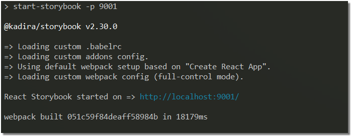
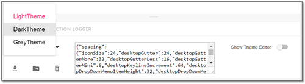

[](https://github.com/sm-react/react-theming/stargazers) 

<div align="center" style="height: 16px;"><sub>Created with ❤︎ to <b>React</b> and <b>React Storybook</b> by <a href="https://twitter.com/UsulPro">UsulPro</a>.</sub></div>


**React-Theming** provides a set of tools for developing themable React apps with **React-Storybook** under the hood. This project includes three main parts:

 :small_blue_diamond: | :small_blue_diamond:  |  :small_blue_diamond:  | :small_blue_diamond:  |  :small_blue_diamond:  
------ | ----- | ------ | ---- | ----
[Addon for Storybook](https://github.com/sm-react/storybook-addon-material-ui) | The core of React-Theming | [](https://github.com/sm-react/storybook-addon-material-ui) | [](https://sm-react.github.io/storybook-addon-material-ui) | [](https://badge.fury.io/js/storybook-addon-material-ui) 
[React Theme Provider](https://github.com/sm-react/react-theme-provider) | A generic theme provider and (very) simple CSS styler |  [](https://github.com/sm-react/react-theme-provider) | [](https://sm-react.github.io/react-theme-provider) | [](https://badge.fury.io/js/react-theme-provider)  
[The Boilerplate Project](https://github.com/UsulPro/myjunkstaff/blob/master/docs/readme.md#storybook-boilerplate-project) | Starting point for apps development | [](https://github.com/sm-react/react-theming) | [](https://sm-react.github.io/react-theming) | [](https://badge.fury.io/gh/sm-react%2Freact-theming)

---

## Storybook Boilerplate Project

[](https://badge.fury.io/gh/sm-react%2Freact-theming)
[](https://sm-react.github.io/react-theming)

At the heart of this project the desire to collect the best practices of application development via [React-Storybook](https://github.com/storybooks/react-storybook) environment. This project is transparent and friendly for developers. You do not need to eject anything. Therefore you can easily add your own configuration and extend it using any packages.

It contains the *fully-charged* setup of the Storybook with **pre-installed plugins**, configuration, quick examples, and tips. Inspired by [Create React App](https://github.com/facebookincubator/create-react-app) and [React CDK](https://github.com/kadirahq/react-cdk).

--

### Features

Since we are now at the starting point, we mark with [](#roadmap) icon features that will be implemented in the near future. See our further plans in the [roadmap](#roadmap) section.

- React Storybook Addons:

 - [](#roadmap) [React Storybook Info Addon](https://github.com/storybooks/react-storybook-addon-info) - *show additional <b>information</b> for your stories*

 - [](#roadmap) [Storybook Addon Notes](https://github.com/storybooks/storybook-addon-notes) - *allows you to write <b>notes</b> for your stories*

 - [Storybook Addon Actions](https://github.com/storybooks/storybook-addon-actions) (included by default) - *the <b>Action Logger</b> addon can be used to display data received by event handlers*

 - [](#roadmap) [Storybook Addon Knobs ](https://github.com/storybooks/storybook-addon-knobs) - *allows you to <b>edit</b> React props dynamically*

 - [Storybook Addon Material-UI](https://github.com/sm-react/storybook-addon-material-ui) - *provides live <b>theme</b> creating environment to React Storybook*

- Testing:

 - [](#roadmap) [StoryShots](https://github.com/storybooks/storyshots) - *provides [Snapshot Testing](https://facebook.github.io/jest/blog/2016/07/27/jest-14.html) for React Storybook*
 
 - [Mocha](https://github.com/mochajs/mocha) and [Enzyme](https://github.com/airbnb/enzyme)

- React ecosystem:

 - [Material-UI](http://www.material-ui.com/#/) - *via [Storybook Addon Material-UI](https://github.com/sm-react/storybook-addon-material-ui)*
 
 - [React Theme Provider](https://github.com/sm-react/react-theme-provider)

- Workflow *(via NPM scripts command)*:

 - Support for Linux, macOS, and Windows

 - [](#roadmap) Build your App with [Webpack](https://github.com/webpack/webpack) and [Babel](https://github.com/babel/babel)
 
 - Publish transpiled code into NPM
 
 - Run tests

 - [ESLint](https://github.com/eslint/eslint) with the [Airbnb style guide](https://github.com/airbnb/javascript)
 
 - Deploy your storybook to GitHub Pages
 
--

### Roadmap

[](#roadmap) Add support for **Storybook 3** features

[](#roadmap) Add [Styled Components](https://github.com/styled-components/styled-components) support

[](#roadmap) Deploy your App to GitHub Pages

[](#roadmap) [storybook-addon-comments](https://github.com/storybooks/storybook-addon-comments) - *allows you to add comments for your stories*

[](#roadmap) [storybook-addon-options](https://github.com/storybooks/storybook-addon-options) - *set configure the Storybook UI*

[](#roadmap) Short tutorial for using this tools

[](#roadmap) Suggest your [feature](/../../issues) wich you'd like to see here!

--

### Quick start

###### Instal the project

tip: you can skip this step if you only want to look at this project. Just open [live demo](https://sm-react.github.io/react-theming) page and jump to [here](#you-will-see-the-demo-page-provided-by-react-storybook)

```shell
git clone https://github.com/sm-react/react-theming.git
cd react-theming
npm i
npm start
```

[](https://raw.githubusercontent.com/UsulPro/myjunkstaff/master/docs/doc/npm-start.png) 

Open http://localhost:9001/ in your browser.

###### You will see the demo page provided by React Storybook.

Press `Ctrl-Shft-F` to exit from `Full screen` mode.

Two panel will appear. You will see the list of `stories` at the left panel and the bottom panel for working with themes.

Let's select another theme for this page. Do it via dropdown list at the bottom panel. Out of the box there are three themes: 'Light', 'Dark' and 'Gray'. Check out them.

[](https://raw.githubusercontent.com/UsulPro/myjunkstaff/master/docs/doc/left-pane.png) 

Note the text field with the full theme data. You can change any property and instantly see how the result will affect the appearance of the page. But the best way to edit theme is to use `Theme Editor`. 

Click to `Show Theme Editor`. It'll open a panel with a list of all theme props at the right. Click to any colored box in this list to open the color picker tool, for example on `textColor`. Now you can move your mouse over the color swatches and see how the color of text is changing.

When you feel enough to edit your theme, you can save it for future use. Press [](#you-will-see-the-demo-page-provided-by-react-storybook) to create a JSON file with your theme. Put it to `src/themes/` folder in your project to include it to your theme list automatically. **Note**: you don't need to restart your app after adding a new theme-file to this folder, just refresh your browser. **Roadmap**: we are working to eliminate even this need to refresh the page after adding a file.

[](https://raw.githubusercontent.com/UsulPro/myjunkstaff/master/docs/doc/bottom-pane.png)

Okay, now let's look at the panel on the left. In fact, our application consists of two components: `src/Header.jsx` and `src/Intro.jsx`. Selecting the appropriate items in the left-side list you switch to an isolated view of the component. It's how `React Storybook` works - allows you 'step-by-step' to create and works with React components. You can improve the quality of development by applying different addons to Storybook. Most of them is already pre-installed in this project. You will find excellent [documentation and examples](https://getstorybook.io/docs/) on the React Storybook website.

---

### FAQ

--
##### I'm not going to create a themable app. Will I find something usefull in this boilerplate project?

Yes! You still have a powerfull dev environment with React Storybook addons, testing and workflow features.

--
##### I'm not going to use Material-UI (any other tool) in my app. Will I find something usefull in this boilerplate project?

Yes! You still have a powerfull dev environment with React Storybook addons, testing and workflow features.

--
##### I'd like to see my [favorite tool](https://github.com/facebook/react/wiki/Complementary-Tools) in this project.

Create an [issue](/../../issues) with your suggestion. We'll be glad to discuss it and we love adding new features!

--
##### What if I need some other package in my project?

Just install it via `npm` or `yarn`. Since this project does not have any hidden configurations, you are free to continue to work with it as you normally would.

---

### Contribute

We'll appreciate any help, ideas, issues and feedback!

