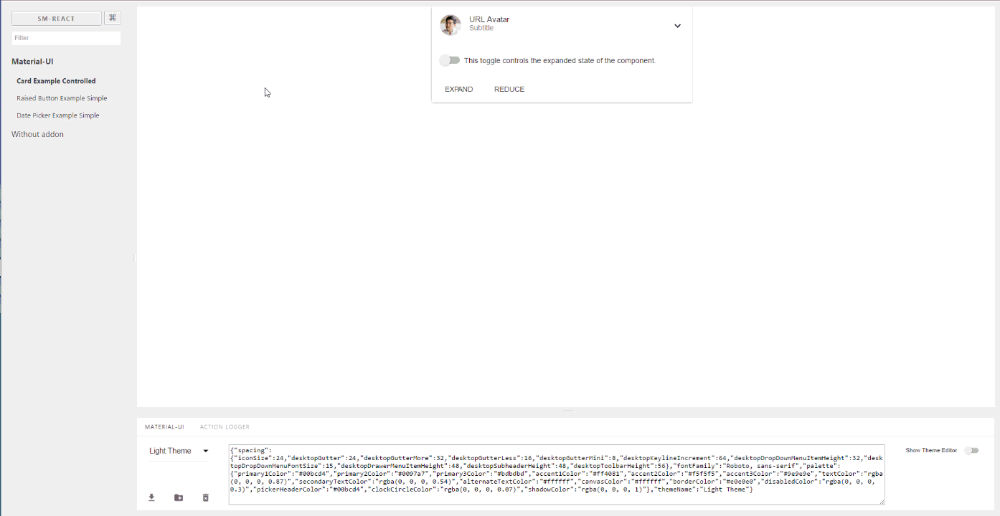
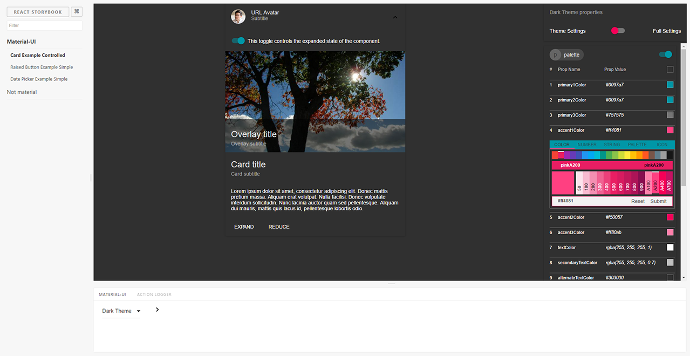
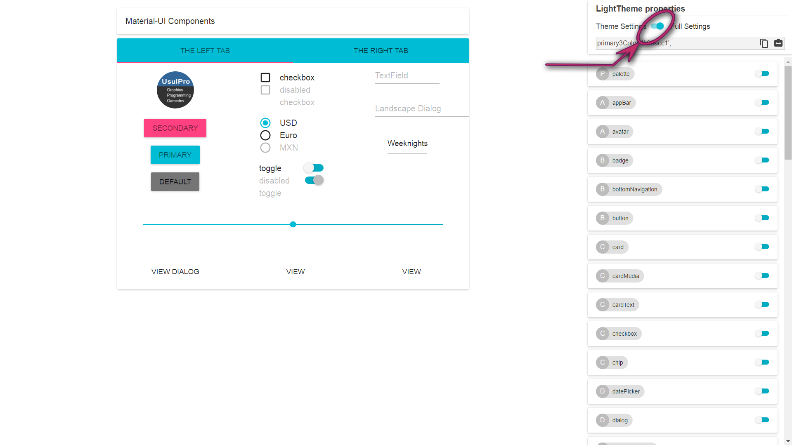

[](https://badge.fury.io/gh/react-theming%2Fstorybook-addon-material-ui)
[](https://badge.fury.io/js/storybook-addon-material-ui)
[](https://sm-react.github.io/storybook-boilerplate/?theme-ind=0&theme-sidebar=false&theme-full=false&knob-Title=Welcome%20to%20React-Theming&knob-Subtitle=Storybook%20Boilerplate%20Project&knob-Label1=Hello%20Button&knob-Label2=Hello%20Button&selectedKind=Material-UI&selectedStory=Components&full=0&down=1&left=1&panelRight=0&downPanel=sm%2Fstorybook-addon-material-ui%2Fmaterial-panel)

#  Storybook Addon Material-UI
The core of [**React Theming**](https://github.com/react-theming/react-theming) project

## Announcement Material-UI v1 support

`storybook-addon-material-ui@0.9.0-alpha.2` now supports Material-UI v1 themes. It has only basic functionality since v.1 themes are very different from the previous version. We would appreciate if you give us your feedback about the most needed features which we will reimplement.

**You can do it with this anonymous [survey](https://app.qpointsurvey.com/s.aspx?c=**F2VOSpTXOlnHHqMaZKSSV5a1ylaCDoRfhut3oNCox34~**).**

It contains only 10 questions and helps us to provide you with the best DX. You are always welcome to submit an [issue](https://github.com/react-theming/storybook-addon-material-ui/issues) as well :smile:

[](https://storybooks.js.org/docs/react-storybook/addons/addon-gallery/)
Provides development environment wich helps creating [Material-UI Components](http://www.material-ui.com/). This is addon for [React Storybook](https://github.com/storybooks/react-storybook) wich wraps your components into MuiThemeProvider. This accelerates and simplifies the [development](#getting-started-bookmark_tabs) process for Material-UI based applications.

You can use this [project's demo page](https://sm-react.github.io/storybook-boilerplate/?theme-ind=0&theme-sidebar=false&theme-full=false&knob-Title=Welcome%20to%20React-Theming&knob-Subtitle=Storybook%20Boilerplate%20Project&knob-Label1=Hello%20Button&knob-Label2=Hello%20Button&selectedKind=Material-UI&selectedStory=Components&full=0&down=1&left=1&panelRight=0&downPanel=sm%2Fstorybook-addon-material-ui%2Fmaterial-panel) to discover `Material-UI Theme Settings` for any component and  create your `own new themes` right online. But to take [full advantage](#features-dizzy) of this project [run it locally](#quick-start) in your work environment.

[](https://raw.githubusercontent.com/react-theming/storybook-addon-material-ui/master/docs/WatchMe.gif)

## Features :dizzy:

[](https://sm-react.github.io/storybook-boilerplate/?theme-ind=0&theme-sidebar=false&theme-full=false&knob-Title=Welcome%20to%20React-Theming&knob-Subtitle=Storybook%20Boilerplate%20Project&knob-Label1=Hello%20Button&knob-Label2=Hello%20Button&selectedKind=Material-UI&selectedStory=Components&full=0&down=1&left=1&panelRight=0&downPanel=sm%2Fstorybook-addon-material-ui%2Fmaterial-panel)

- Wrapped in the theme provider. Just start to develop with base light theme.
- Injected TapEvent Plugin. Test on mobile devices.
- Switching themes. See how it looks in one click.
- Creating your custom theme. By code or in visual editor.
- Dynamic visual themes editing. Discover the all avalibale theme properties.
- Google [material color](https://material.google.com/style/color.html#color-color-palette) palette [picker](https://github.com/sm-react/react-material-color-picker)
- Save made changes and download in JSON file
- Part of [React Theming](https://github.com/react-theming/react-theming). Create themable React Components.
- Works with Storybook 3.0

## Quick Start

The fastest and easiest way to start hacking Material-UI from scratch is to clone [Storybook Boilerplate Project](https://github.com/sm-react/storybook-boilerplate). *You need to have `NodeJS` and `Git` installed in your machine*.

```shell
git clone https://github.com/sm-react/storybook-boilerplate.git
cd storybook-boilerplate
npm i
npm start
```

<details>
  <summary>
    Few short steps to create your themable `Material-UI` Components :point_up_2:
  </summary>

Open [http://localhost:9001/](http://localhost:9001/) in your browser.

Press `Ctrl-Shft-F` to exit from `Full screen` mode.

Select `Material-UI` at the left panel. You'll see two stories with Material-UI Components: `Components` and `Card`.

Select `Material-UI` at the bottom panel. You can **switch themes** from drop-down menu. Out of the box you have tree themes: `Light Theme` _(Material-UI default)_, `Dark Theme` _(Material-UI)_, `Grey Theme` _(React Theming Complimentary :gift:)_,

Open you project folder. Find [`src/MaterialUI/`](https://github.com/sm-react/storybook-boilerplate/tree/master/src/MaterialUI) directory. You'll find `JSX` files with Material-UI based React Components. You can use them as a starting point to **create your own components**.

In oder to see your components in storybook add them to `src/MaterialUI/index.story.jsx`. You can do it [this way](https://github.com/sm-react/storybook-boilerplate/blob/master/src/MaterialUI/index.story.jsx#L30-L32). You can read more about writing stories in their [documentation](https://getstorybook.io/docs/react-storybook/basics/writing-stories).

Your **themes files** are located in the [`src/.themes`](https://github.com/sm-react/storybook-boilerplate/tree/master/src/.themes) folder as a JSON files. Please note that all JSON files from this folder are [imported automatically](https://github.com/sm-react/storybook-boilerplate/blob/master/src/MaterialUI/index.story.jsx#L10-L14). So you can change them or add the new ones and you'll see this themes in your Storybook.

You can edit the theme settings in `Theme.json` files manually, but the **power** of this project is that you can _do it in your browser and see all changes immediately_ on your Material-UI Components. See **[Usage details](#usage-details)** to learn about working with themes.

</details>

:triangular_flag_on_post: The [Storybook Boilerplate](https://github.com/sm-react/storybook-boilerplate) contains many additional features for creating themable React Components, allows publishing your packages to `npm` and deploying your storybooks to `Github Pages`. It includes linting and testing scripts and other useful `Storybook Addons`.

If you already using `React Storybook` and have it installed in your project you can add this addon manually. Follow [Getting Started](#getting-started-bookmark_tabs) section to install `storybook-addon-material-ui` and find detailes about using it. You can **add** `React Storybook` to your **existing project** as well, check the [documentation](https://getstorybook.io/docs/react-storybook/basics/quick-start-guide) for that.

## Roadmap :mountain_cableway:

We have many plans and ideas for further development. See [**projects**](https://github.com/react-theming/storybook-addon-material-ui/projects/1) about what kind of features we plan to implement in the future. We create this tool for your convenience and productivity, so we are always happy to [**hear**](https://github.com/react-theming/storybook-addon-material-ui/issues/new) your ideas and wishes.

## Getting Started :bookmark_tabs:

First, install the addon

```shell
npm i storybook-addon-material-ui --save-dev
```

Add this line to your addons.js file (create this file inside your storybook config directory if needed).

```js
import 'storybook-addon-material-ui';
```

Now, write your stories with Material-UI Addon. By default your stories will be provided with [`Light Base Theme`](https://github.com/callemall/material-ui/blob/master/src/styles/baseThemes/lightBaseTheme.js) and [`Dark Base Theme`](https://github.com/callemall/material-ui/blob/master/src/styles/baseThemes/darkBaseTheme.js)

```js
import React from 'react';
import { storiesOf, addDecorator } from '@storybook/react';
import {muiTheme} from 'storybook-addon-material-ui';

// Import some examples from material-ui
import CardExampleControlled from '../CardExampleControlled.jsx';
import RaisedButtonExampleSimple from '../RaisedButtonExampleSimple.jsx';
import DatePickerExampleSimple from '../DatePickerExampleSimple.jsx';

storiesOf('Material-UI', module)
// Add the `muiTheme` decorator to provide material-ui support to your stories.
// If you do not specify any arguments it starts with two default themes
// You can also configure `muiTheme` as a global decorator.
    .addDecorator(muiTheme())
    .add('Card Example Controlled', () => (
            <CardExampleControlled />
        ))
    .add('Raised Button Example Simple', () => (
            <RaisedButtonExampleSimple />
        ))
    .add('Date Picker Example Simple', () => (
            <DatePickerExampleSimple />
        ));
```
> Note : You can switch between the loaded themes. Out of the box, you have two base themes, but you can simply add your custom themes like this:

```js
import React from 'react';
import { storiesOf, addDecorator } from '@storybook/react';

import {muiTheme} from 'storybook-addon-material-ui';

import CardExampleControlled from '../CardExampleControlled.jsx';
import RaisedButtonExampleSimple from '../RaisedButtonExampleSimple.jsx';
import DatePickerExampleSimple from '../DatePickerExampleSimple.jsx';

// Create your own theme like this.
// Note: you can specify theme name in `themeName` field. Otherwise it will be displayed by the number.
// you can specify only required fields overriding the `Light Base Theme`
const newTheme = {
    themeName: 'Grey Theme',
    palette: {
        primary1Color: '#00bcd4',
        alternateTextColor: '#4a4a4a',
        canvasColor: '#616161',
        textColor: '#bdbdbd',
        secondaryTextColor: 'rgba(255, 255, 255, 0.54)',
        disabledColor: '#757575',
        accent1Color: '#607d8b',
    },
};


storiesOf('Material-UI', module)
    .addDecorator(muiTheme([newTheme]))
    .add('Card Example Controlled', () => (
            <CardExampleControlled />
        ))
    .add('Raised Button Example Simple', () => (
            <RaisedButtonExampleSimple />
        ))
    .add('Date Picker Example Simple', () => (
            <DatePickerExampleSimple />
        ));


```

## Usage details

Select `MATERIAL-UI` panel. You can select the theme you need to see and you will have all theme settings in the right sidebar. You can toggle `Theme editor` with all theme settings in a editable table. It'll appear as a right sidebar.

You can edit the value manually as a text string or via picker tool (click the icon to the right of the input)



By default you see only assigned fields of selected theme. You can switch to `Full settings` and all available settings will appear. As you override one of them it will appear in the `Theme setting` mode and in the bottom panel JSON area.



After you have made changes in the theme, you can save it and download as *.JSON file.

>You can continue to work with this file:
```
import greyTheme from './greyTheme.json';
addDecorator(greyTheme);
```

## Query string parameters

As you select themes and other options it stores in adress bar line. So this state is retained when you refresh the page and you can use direct links to the desired states.

```
http://localhost:9001/?theme-ind=0&theme-sidebar=true&theme-full=true
```

## CONTRIBUTING :raising_hand:

[](./.eslintrc)
[](https://www.codetriage.com/react-theming/storybook-addon-material-ui)

### :wrench: Developers:

Our team welcome all contributing, testing, bug fixing. If you would like
to help contribute to the project feel free to make an issue, PR or get in touch with me.

### :ribbon: Designers:

We would really welcome the involvement of designers in this project. We are very interested in your opinion about working with this tool, the possibility of joint work of the designer and developer as well as its appearance and capabilities

#### Credits
[](https://twitter.com/usulpro)
[](https://github.com/UsulPro)
[](https://github.com/react-theming)

