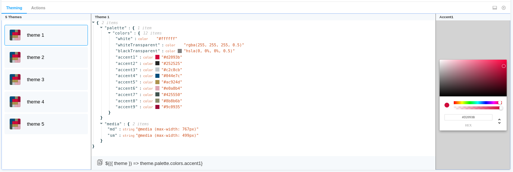

[](https://badge.fury.io/js/%40react-theming%2Fstorybook-addon)
[](https://react-theming.github.io/storybook-addon)

# Storybook Addon @ React Theming

Storybook addon for Styled Components, Emotion, Material-UI and any other theming solution. Allows to develop themed components in isolation.

```shell
npm i --save-dev @react-theming/storybook-addon
```
[Demo](https://react-theming.github.io/storybook-addon)



## Features :dizzy:

- Universal - can be used with any styling library
- Switching between themes from addon panel.
- Change a color and see how it affects to your components
- Easily copy-paste paths of nesting theme props into your code 


## Usage

specify addon in `.storybook/main.js`

```js
// .storybook/main.js

module.exports = {
  stories: ['../src/**/*.stories.js'],
  addons: ['@react-theming/storybook-addon'],
};
```

or in `.storybook/addons.js` for older versions of Storybook

```js
import '@react-theming/storybook-addon/register';

```

Then you'll need to add a decorator with a ThemeProvider of your library. This project is not related to any particular styling solutions, instead, you can use **any of theme providers** you're using in your project.

```js
import ThemeProvider from 'library-of-your-choice';
import { withThemes } from '@react-theming/storybook-addon';
import { theme } from '../src/theme';

// create decorator
const themingDecorator = withThemes(ThemeProvider, [theme]);
```

ThemeProvider should accept a theme via `theme` props. This is usually the case for the most common styling libraries like Styled Components, Emotion, Material-UI.

In case of non standard ThemeProvider you can pass `providerFn` function in options:

```js
const providerFn = ({ theme, children }) => {
  return <ThemeProvider theme={muTheme}>{children}</ThemeProvider>;
};

const themingDecorator = withThemes(null, [theme], { providerFn });
```

Below the use cases for most popular styling libraries:

## Using with Emotion

```js
// .storybook/preview.js

import { ThemeProvider } from 'emotion-theming';
import { addDecorator } from '@storybook/react';
import { withThemes } from '@react-theming/storybook-addon';

import { theme } from '../src/theme';

// pass ThemeProvider and array of your themes to decorator
addDecorator(withThemes(ThemeProvider, [theme]));
```


## Using with Styled Components

```js
// .storybook/preview.js

import { ThemeProvider } from 'styled-components';
import { addDecorator } from '@storybook/react';
import { withThemes } from '@react-theming/storybook-addon';

import { theme } from '../src/theme';

// pass ThemeProvider and array of your themes to decorator
addDecorator(withThemes(ThemeProvider, [theme]));
```


## Using with Material-UI

```js
// theme.js
import { red } from '@material-ui/core/colors';

// A custom theme for this app
const theme = {
  palette: {
    primary: {
      main: '#556cd6',
    },
    secondary: {
      main: '#19857b',
    },
    error: {
      main: red.A400,
    },
    background: {
      default: '#fff',
    },
  },
};

export default theme;
```

```js
// .storybook/preview.js

import { ThemeProvider } from '@material-ui/core';
import { createMuiTheme } from '@material-ui/core/styles';
import { addDecorator } from '@storybook/react';
import { withThemes } from '@react-theming/storybook-addon';

import theme from '../src/theme';

const providerFn = ({ theme, children }) => {
  const muTheme = createMuiTheme(theme);
  return <ThemeProvider theme={muTheme}>{children}</ThemeProvider>;
};

// pass ThemeProvider and array of your themes to decorator
addDecorator(withThemes(null, [theme]));
```

```js
// index.js

import React from 'react';
import ReactDOM from 'react-dom';
import { ThemeProvider } from '@material-ui/core/styles';
import { createMuiTheme } from '@material-ui/core/styles';
import App from './App';
import theme from './theme';

ReactDOM.render(
  <ThemeProvider theme={createMuiTheme(theme)}>
    <App />
  </ThemeProvider>,
  document.querySelector('#root'),
);

```

There is an example app with CRA, Material-UI and Storybook Addon [Demo](https://react-theming.github.io/theming-material-ui/) [Source](https://github.com/react-theming/theming-material-ui)


## Credits

<div align="left" style="height: 16px;">Created with ❤︎ to <b>React</b> and <b>Material UI</b> by <a
    href="https://twitter.com/UsulPro">Oleg Proskurin</a> [<a href="https://github.com/react-theming">React Theming</a>]
</div>
