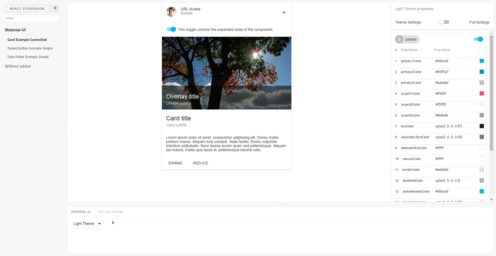
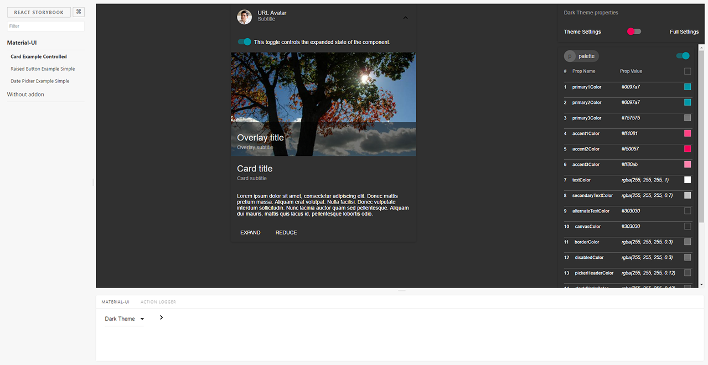
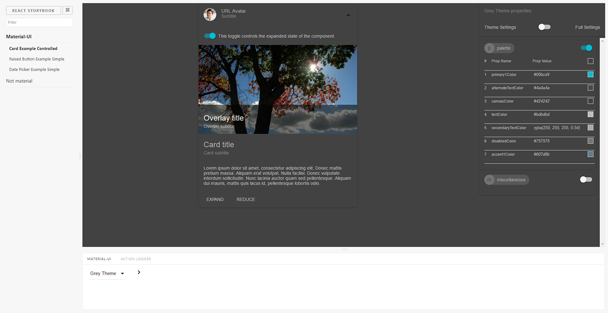

### default `Light base theme`
quick start for component development

### default `Dark base theme`
Check a different appearance

### Visual color adjusting
Results instantly on the screen

### User created theme

### Full theme settings

### After overriding
you will have only chanded setting in your theme
